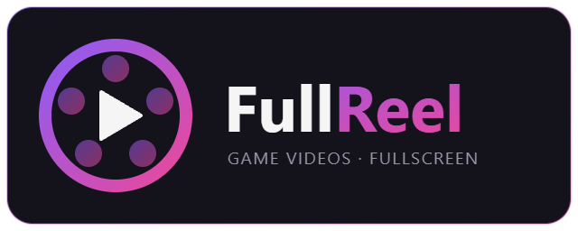

# FullReel Playnite Extension

   

  

  

A Playnite extension for browsing and watching YouTube videos for your games in a fullscreen, controller-friendly player. Search for trailers, gameplay, walkthroughs, reviews, and guides, watch them without leaving Playnite, and download trailers into the ExtraMetadataLoader folder.

Designed as a complement to [ExtraMetadataLoader](https://github.com/darklinkpower/PlayniteExtensionsCollection), and built for both Desktop and Fullscreen mode.

Built with the help of Claude Code and Cursor IDE

---

## 🎬 Demo

  <video src="https://github.com/user-attachments/assets/595f2c39-c482-4de9-9c1c-07a7829d14d0" width="440" controls></video>

---

## 🎬 Features

- **Category Search** - Right-click a game and pick **FullReel** to search YouTube, browsed by category tab (trailers, gameplay, walkthroughs, reviews, guides). Results stream in instantly with thumbnails, titles, durations, channel, and view counts.
- **Fullscreen Player** - A borderless player that streams direct from YouTube. Autoplays on open, plays the best quality the source offers (1440p/4K when available; optional *Prefer 1080p first*), and uses a smooth direct-render path.
- **Controller and Keyboard** - Both fully drive the player and results list (play/pause, seek, volume, fullscreen, screenshot, download, close), respecting Playnite's Swap Confirm/Cancel setting.
- **Frosted-Glass UI** - Real backdrop-blur controls and an auto-hiding title bar over the live video, with 6 selectable bar styles (MinimalGlass default, plus FrostedBlur, HeavyFrost, TintedPurple, GradientFade, Performance) and a live preview in settings.
- **Trailer Downloads** - Save a video into the game's ExtraMetadataLoader folder as `VideoTrailer.mp4` (H.264 / AAC), so EML plays it as the game's trailer. Quality and cookies are configurable.
- **UniPlaySong Integration** - Pauses [UniPlaySong](https://github.com/aHuddini/UniPlaySong)'s music while a video plays and resumes it on close. Does nothing if UniPlaySong isn't installed. On by default.
- **Tool-Path Validation** - yt-dlp, ffmpeg, and deno path pickers in settings, each validated with a live status readout so a missing tool is caught before it breaks search or download.

---

## Requirements

- **yt-dlp**, **ffmpeg**, and **deno**. Set their paths in the add-on's settings; each is validated with a live status. [deno](https://deno.com) is yt-dlp's JavaScript runtime for YouTube's stream-signature challenges, and without it search and download can fail.
- **WebView2 Evergreen runtime 132+**, aka Edge browser. Required to watch videos. Preinstalled on most Windows 11 systems; otherwise install Microsoft's Evergreen runtime.
- [Optional] **[ExtraMetadataLoader](https://github.com/darklinkpower/PlayniteExtensionsCollection)**, optional and needed only for the downloaded-trailer playback complement.

---

## How to Use

1. Right-click a game or access Fullreel in the extensions menu of Fullscreen. Pick **FullReel**. The results window opens and fills in as videos are found, sorted into category tabs.
2. Navigate the results with the D-pad or arrow keys, and switch category tabs with LB/RB or Q/E.
3. On a result:
   - **A / Enter** to watch it fullscreen
   - **Y / D** to download it as the game's trailer
   - **B / Esc** to close and return to Playnite

The player's title bar and controls bar are real frosted glass (backdrop-blur over the live video). The title bar auto-hides during playback and reappears on input. Pick from 6 controls-bar styles in **Settings → Player → Controls bar**, each with a live preview.

---

## EML Trailer Note

Downloads land as `VideoTrailer.mp4` in the game's ExtraMetadataLoader folder (`{ConfigurationPath}\ExtraMetadata\games\{gameId}\VideoTrailer.mp4`), encoded H.264 / yuv420p / AAC so EML plays it untouched. Re-select the game in your library so ExtraMetadataLoader picks up the new trailer.

---

## Settings

- **Tool paths**: yt-dlp, ffmpeg, and deno pickers, each validated with a live status message.
- **Cookies**: browser cookies or a custom cookies file, for age-restricted or region-locked videos.
- **Download quality**: pick the quality for saved trailers.
- **Playback quality**: *Prefer HD playback* (on by default) reaches for the best format the source offers; *Prefer 1080p first* caps it at 1080p for a lighter default.
- **Player controls bar**: choose one of the 6 glass styles (MinimalGlass default), with a live preview image.
- **UniPlaySong integration**: pause UniPlaySong's music while a video plays. On by default.
- **Debug logging**: verbose log for troubleshooting.

---

## Known Issues

- **Age-restricted videos** can't be played in the embedded player. YouTube blurs their thumbnails in the results and points you to watching them directly on YouTube. You might be able to bypass this with cookies.
- **Video quality depends on the source upload.** Some channels upload choppy or low-bitrate videos that look poor even at 1080p, while others (official publisher channels like PlayStation) look excellent at the same resolution. The quality pill icon will show the true decoded resolution.

---

## Troubleshooting

**Search or downloads return nothing:**

1. All three tools must show a checkmark in settings — **yt-dlp, ffmpeg, AND deno**. YouTube now needs deno to fetch videos, so a missing/invalid deno silently breaks search and download.
2. Use the official **Windows (.exe)** builds of all three: `yt-dlp.exe`, the Windows build's `ffmpeg.exe`, and the Windows `deno.exe`.
3. **Best practice:** put `deno.exe` in the **same folder** as `yt-dlp.exe`.
4. Keep the tools in a simple path (e.g. `C:\Tools\`), not folders with unusual characters, and off read-only or system-protected locations.
5. If you downloaded the `.exe` files with a browser, right-click each → Properties → **Unblock**.
6. **Search works but downloads fail?** Check **Cookies source** in settings. Browser cookies (especially Chrome/Edge) often can't be read on recent browser versions. Set it to **None**, or use a custom `cookies.txt` file — only enable cookies for age-restricted or region-locked videos.
7. Still stuck? Enable **debug logging** in settings, retry, then open the log folder and check `FullReel.log` for the exact error.

---

## Support

If FullReel is useful to you, consider [buying me a coffee](https://ko-fi.com/huddini).
